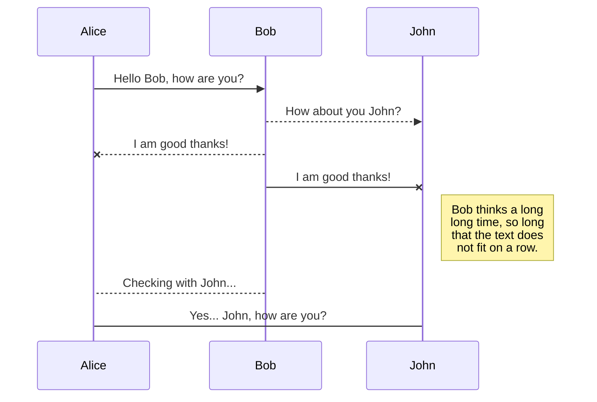

# Node.JS + Express 
NodeJS: 구글 크롬의 자바스크립트 엔진 (V8 Engine) 에 기반해 만들어진 **서버 사이드 플랫폼**

Express: NodeJS 상에서 동작하는 **웹 애플리케이션 프레임워크**

## 개발 환경

**웹 서버**
- OS: Windows 10
- 웹 엔진: NodeJS v10.16.2
- 웹 프레임워크: Express v4.16.1

**데이터베이스 서버**
- OS: Ubuntu 18.04.3 LTS
- DB: MySQL 8.0.17

**모듈**
- bootstrap: 4.3.1 
- cookie-parser: 1.4.4
- dateformat: 3.0.3
- debug: 2.6.9
- ejs: 2.6.1
- express: 4.16.1
- express-mysql-session: 2.1.0
- express-session: 1.16.2
- http-errors: 1.6.3
- jquery: 3.4.1
- jquery-validation: 1.19.1connect-flash: 0.1.1
- cookie-parser: 1.4.4
- dateformat: 3.0.3
- debug: 2.6.9
- ejs: 2.6.1
- express: 4.16.1
- express-mysql-session: 2.1.0
- express-session: 1.16.2
- http-errors: 1.6.3
- jquery: 3.4.1
- jquery-validation: 1.19.1
- memory-cache: 0.2.0
- method-override: 3.0.0
- moment: 2.24.0
- moment-timezone: 0.5.26
- mysql: 2.17.1
- passport: 0.4.0
- passport-local: 1.0.0
- pbkdf2-password: 1.2.1
- session-file-store: 1.3.1
- tablefilter: 0.6.96
- winston: 3.2.1
- winston-daily-rotate-file: 4.1.0

## 서버 설치

**NodeJS 설치**
- Node.JS 홈페이지에 접속하여 패키지 다운로드
- Node.JS 홈페이지: [https://nodejs.org/ko/](https://nodejs.org/ko/)

**Express 프레임워크 설치**
``npm install -s express``

**모듈 설치**
``npm install -s [MODULE_NAME]``

또는,

**github clone**
``git clone https://github.com/lilyseek/gbsoft.git ``


# Node.JS + Express 설명

## Node.JS + Express 디렉토리 구조

### 폴더 구조
```text
/app
  ⌊ /bin
      ⌊ www
  ⌊ /lib
      ⌊ common.js      
      ⌊ logger.js      
      ⌊ passport.js      
  ⌊ /log
  ⌊ /model
      ⌊ db_control.js      
      ⌊ db.js        
  ⌊ /node_modules
  ⌊ /public
      ⌊ /images
      ⌊ /javascripts
      ⌊ /stylesheets
  ⌊ /routes
      ⌊ index.js
      ⌊ auth.js
  ⌊ /views
      ⌊ index.ejs
      ⌊ login.ejs
      ⌊ user.ejs
  ⌊ app.js
  ⌊ config.json
  ⌊ package.json
```
**/bin/www**: 웹 서버 구동을 위한 라이브러리

**/lib**: 사용자 정의 라이브러리
-- /lib/common.js: 공통으로 쓰이는 사용자 정의 라이브러리
-- /lib/logger.js: 로그 기록 라이브러리
-- /lib/passport.js: 로그인 및 세션 관리 라이브러리

**/log**: 로그 파일 저장 디렉토리

**/model**: 데이터베이스 라이브러리
-- /model/db_control.js: MySQL 쿼리 송수신 라이브러리
-- /model/db.js: MySQL DB 연결 라이브러리

**/node_modules**: 사용자가 설치한 모듈 저장 디렉토리

**/public**: 정적 디렉토리
-- /public/images: 이미지/아이콘 디렉토리
-- /public/javascripts: 자바스크립트 디렉토리
-- /public/stylesheets: CSS 디렉토리

**/routes**: URI 별로 수행되는 로직 디렉토리 
-- /routes/index.js: `/` URI로 웹 페이지를 요청하였을 때 실행되는 로직 (localhost:3000/)
-- /routes/auth.js: `auth` URI로 웹 페이지를 요청하였을 때 실행되는 로직 (localhost:3000/auth)

**/views**: 사용자 브라우저에 출력할 템플릿 디렉토리 
-- /views/index.ejs: index 페이지
-- /views/login.ejs: login 페이지
-- /views/user.ejs: user 페이지

**/app.js**: 익스프레스 설정 파일이 담겨있는 핵심 코드

**/config.json**: 데이터베이스/시스템 설정

**/package.json**: 서버 구동에 필요한 필수 모듈(dependency)들의 목록
       

## Node.JS + Express 동작


 1. 사용자로부터 HTTP Request 메시지(ReqMsg) 수신
 2. *Routes*는 ReqMsg에 포함된 URI을 분석 한 후, 알맞은 *Controllers*로 ReqMsg를 전달 (i.e., *Controller* 함수 호출)
 4. *Routes*에 의해 호출된 *Controllers* 함수는 필요 시, DB를 조회하기 위해 *Models*로 해당 메시지를 전달(i.e., *Model* 함수 호출)
 5. ReqMsg에 대한 *Controllers*의 처리가 종료되면, 응답 메시지(ResMsg)를 출력하기 위해 *Views*에 저장된 템플릿을 렌더링하여 HTML 문서로 생성
 6. 생성된 HTML 문서를 사용자에게 전달

### 라우트 처리

    요청-->라우트-->라우트에서 처리 함수 호출-->Views의 템플릿 렌더링(HTML로 변환)

**root 페이지 조회 요청(GET Method)**
```javascript
router.get('/', common.isAuthenticated, function(req, res, next) {
	res.render('index', {user:  req.user});
});
```
> **router.get**: HTTP Request가 GET Method 인 경우(특정 페이지 요청)
> **'/'**: root 페이지를 요청한 경우 처리 (localhost:3000/)
> **common.isAuthenticated**: 요청 사용자가 로그인 상태인지 검증하는 사용자 정의 함수
> function(req, res, next)
> -- req: Request Message
> -- res: Response Message
> -- next: next route or function
> **res.render**: Views에 저장된 템플릿을 렌더링하기 위한 함수
> -- index: index 템플릿을 렌더링하여 html 문서로 변환
> -- user: req.user: 요청 메시지에 포함된 user 객체를 index 렌더링 시 전달

**dashboard 페이지 조회 요청 (GET Method)**
```javascript
router.get('/dashboard', common.isAuthenticated, function(req, res, next) {
	res.render('dashboard', {user:  req.user});
});
```
> **'/dashboard'**: dashboard 페이지를 요청한 경우 처리 (localhost:3000/dashboard)

**user 페이지 user 삭제 요청 (DELETE Method)**
```javascript
router.delete('/user', function(req, res, next) {
	opDB.delete('user', req.body.d_id, function(err, count) {
		if (err) { console.log('err :'  +  err); }
		return  res.redirect('/auth/user');
	});
});
```
> **router.delete**: HTTP Request가 DELETE Method 인 경우(삭제 요청)
> **'/user'**: user 페이지를 요청한 경우 처리 (localhost:3000/user[^1]
> **opDB.delete**: DB의 특정 레코드를 삭제하기 위해 Models 함수 호출
> **res.redirect('/auth/user')**: Response 메시지를 router.get('/auth/user') 라우터로 전달 (i.e., /user에 대한 delete 라우터의 처리 후, /user에 대한 get 라우터로 전달)

[^1]: 실제 요청 주소는 localhost:3000/auth/user 이나, 해당 router는 auth 디렉토리 내에 있기 때문에 /user라고만 하였음.


### CRUD REST API 컨셉
**CRUD**
- 기본적인 데이터 처리 기능 또는 연산 (Create, Read, Update, Delete)

**REST (Representational State Transfer)**
- 리소스의 이름으로 구분하여 해당 리소스의 상태를 주고 받는 방식
- HTTP URI를 통해 리소스를 명시하고, HTTP Method(POST, GET, PUT, DELETE)를 통해 해당 자원에 대한 CRUD Operation을 적용

**REST API**
- REST 방식을 기반으로 서비스 API를 구현

**REST 방식의 서비스 API 예제 - user 처리 부분 -**

- /routes/auth/user.js - **Route**
```javascript
/* USER 정보 조회 */
router.get('/user', function (req, res) {
	// USER 정보 조회 처리 부분, DB 조회 등
	opDB.getAll('user', function(err, user) { ... }
	// user 템플릿 렌더링
	res.render('user' {user:  user});
});
/* 아이디로 USER 정보 조회 */
router.get('/user/:id', function (req, res) {
	// USER 정보 조회 처리 부분, DB 조회 등
	opDB.getById('user', req.query.id, function(err, user) { ... }
	res.send(user);
});
/* USER 추가 */
router.post('/user', function (req, res) {
	opDB.add('user', user, function(err, count) { ... }
	return  res.redirect('/auth/user');
});
/* USER 수정 */
router.put('/user', function (req, res) {
	opDB.update('user', user, req.body.m_id, function(err, count) { ... }
	return  res.redirect('/auth/user');
});
/* USER 삭제 */
router.delete('/user', function(req, res, next) {
	opDB.delete('user', req.body.d_id, function(err, count) { ... }
	return  res.redirect('/auth/user');
});
```
- /model/db_control.js - **Model**
```javascript
var  opDB  = {
	getAll:  function(table, callback) {
		return  db.query('SELECT * FROM ??', [table], callback);
	},
	getById:  function(table, id, callback) {
		return  db.query('SELECT * FROM ?? WHERE `id`=?', [table, id], callback);
	},
	add:  function(table, value, callback) {
		return  db.query('INSERT INTO ?? SET ?', [table, value], callback);
	},
	update:  function(table, value, id, callback) {
		return  db.query('UPDATE ?? SET ? WHERE `id`=?', [table, value, id], callback);
	},
	delete:  function(table, id, callback) {
		return  db.query('DELETE FROM ?? WHERE `id`=?', [table, id], callback);
	},
};
```
- /views/user.ejs - **View**
```html
...
<tbody>
	<% for(var i=0; i<user.length;  i++)  {  %>
	<tr>
		<td><%=user[i].ID%></td>
		<td><%=user[i].NAME%></td>
		<td><%=user[i].EMPNO%></td>
		<td><%=user[i].CENTER_VALUE%></td>
		<td><%=user[i].AUT_VALUE%></td>
		<td><%=user[i].LOCKYN%></td>
		<td><%=user[i].REMARK%></td>
	</tr>
	<%}%>
</tbody>
	...
	<form  id="addUserForm"  action="/auth/user"  method="post">
	...
	<form  id="deleteUserForm"  name="deleteUserForm"  action="/auth/user?_method=DELETE"  method="post">
	...
	<form  id="modifyUserForm"  name="modifyUserForm"  action="/auth/user?_method=PUT"  method="post">
	...
```

**```<td><%=user[i].ID%></td>```**
> -- user 페이지 조회 시(localhost:/3000/auth/user), *router*는 *models*의 opDB.getAll() 함수를 호출하여, DB의 user 데이터를 조회함.
> -- 조회된 데이터는 user 객체로 반환됨.
> -- *router*는 반환된 user 객체를 파라미터로 하여res.render('user' {user:  user}) 함수를 호출함
> -- user.ejs는 router가 넘겨준 파라미터를 포함한 html 문서를 렌더링함

**```<form  id="addUserForm"  action="/auth/user"  method="post">```**
> -- add form에서 submit 시 /auth/user로 데이터를 전달하되 POST method (CREATE)를 사용

**```<form  id="deleteUserForm"  name="deleteUserForm"  action="/auth/user?_method=DELETE"  method="post">```**
> -- delete form에서 submit 시 /auth/user로 데이터를 전달하되 DELETE method (DELETE)를 사용

**```<form  id="modifyUserForm"  name="modifyUserForm"  action="/auth/user?_method=PUT"  method="post">```**
> -- modify form에서 submit 시 /auth/user로 데이터를 전달하되 PUT method (MODIFY)를 사용


Hi! I'm your first Markdown file in **StackEdit**. If you want to learn about StackEdit, you can read me. If you want to play with Markdown, you can edit me. Once you have finished with me, you can create new files by opening the **file explorer** on the left corner of the navigation bar.


```javascript {.line-numbers}
function add(x, y) {
  return x + y
}
```


# 세부 기능

## 로그인
### PASSPORT 모듈 사용

**app.js**
``` Javascript 
var  passport  =  require('./lib/passport')(app);
```


StackEdit stores your files in your browser, which means all your files are automatically saved locally and are accessible **offline!**

## Create files and folders

The file explorer is accessible using the button in left corner of the navigation bar. You can create a new file by clicking the **New file** button in the file explorer. You can also create folders by clicking the **New folder** button.

## Switch to another file

All your files and folders are presented as a tree in the file explorer. You can switch from one to another by clicking a file in the tree.

## Rename a file

You can rename the current file by clicking the file name in the navigation bar or by clicking the **Rename** button in the file explorer.

## Delete a file

You can delete the current file by clicking the **Remove** button in the file explorer. The file will be moved into the **Trash** folder and automatically deleted after 7 days of inactivity.

## Export a file

You can export the current file by clicking **Export to disk** in the menu. You can choose to export the file as plain Markdown, as HTML using a Handlebars template or as a PDF.


# Synchronization

Synchronization is one of the biggest features of StackEdit. It enables you to synchronize any file in your workspace with other files stored in your **Google Drive**, your **Dropbox** and your **GitHub** accounts. This allows you to keep writing on other devices, collaborate with people you share the file with, integrate easily into your workflow... The synchronization mechanism takes place every minute in the background, downloading, merging, and uploading file modifications.

There are two types of synchronization and they can complement each other:

- The workspace synchronization will sync all your files, folders and settings automatically. This will allow you to fetch your workspace on any other device.
	> To start syncing your workspace, just sign in with Google in the menu.

- The file synchronization will keep one file of the workspace synced with one or multiple files in **Google Drive**, **Dropbox** or **GitHub**.
	> Before starting to sync files, you must link an account in the **Synchronize** sub-menu.

## Open a file

You can open a file from **Google Drive**, **Dropbox** or **GitHub** by opening the **Synchronize** sub-menu and clicking **Open from**. Once opened in the workspace, any modification in the file will be automatically synced.

## Save a file

You can save any file of the workspace to **Google Drive**, **Dropbox** or **GitHub** by opening the **Synchronize** sub-menu and clicking **Save on**. Even if a file in the workspace is already synced, you can save it to another location. StackEdit can sync one file with multiple locations and accounts.

## Synchronize a file

Once your file is linked to a synchronized location, StackEdit will periodically synchronize it by downloading/uploading any modification. A merge will be performed if necessary and conflicts will be resolved.

If you just have modified your file and you want to force syncing, click the **Synchronize now** button in the navigation bar.

> **Note:** The **Synchronize now** button is disabled if you have no file to synchronize.

## Manage file synchronization

Since one file can be synced with multiple locations, you can list and manage synchronized locations by clicking **File synchronization** in the **Synchronize** sub-menu. This allows you to list and remove synchronized locations that are linked to your file.


# Publication

Publishing in StackEdit makes it simple for you to publish online your files. Once you're happy with a file, you can publish it to different hosting platforms like **Blogger**, **Dropbox**, **Gist**, **GitHub**, **Google Drive**, **WordPress** and **Zendesk**. With [Handlebars templates](http://handlebarsjs.com/), you have full control over what you export.

> Before starting to publish, you must link an account in the **Publish** sub-menu.

## Publish a File

You can publish your file by opening the **Publish** sub-menu and by clicking **Publish to**. For some locations, you can choose between the following formats:

- Markdown: publish the Markdown text on a website that can interpret it (**GitHub** for instance),
- HTML: publish the file converted to HTML via a Handlebars template (on a blog for example).

## Update a publication

After publishing, StackEdit keeps your file linked to that publication which makes it easy for you to re-publish it. Once you have modified your file and you want to update your publication, click on the **Publish now** button in the navigation bar.

> **Note:** The **Publish now** button is disabled if your file has not been published yet.

## Manage file publication

Since one file can be published to multiple locations, you can list and manage publish locations by clicking **File publication** in the **Publish** sub-menu. This allows you to list and remove publication locations that are linked to your file.


# Markdown extensions

StackEdit extends the standard Markdown syntax by adding extra **Markdown extensions**, providing you with some nice features.

> **ProTip:** You can disable any **Markdown extension** in the **File properties** dialog.


## SmartyPants

SmartyPants converts ASCII punctuation characters into "smart" typographic punctuation HTML entities. For example:

|                |ASCII                          |HTML                         |
|----------------|-------------------------------|-----------------------------|
|Single backticks|`'Isn't this fun?'`            |'Isn't this fun?'            |
|Quotes          |`"Isn't this fun?"`            |"Isn't this fun?"            |
|Dashes          |`-- is en-dash, --- is em-dash`|-- is en-dash, --- is em-dash|


## KaTeX

You can render LaTeX mathematical expressions using [KaTeX](https://khan.github.io/KaTeX/):

The *Gamma function* satisfying $\Gamma(n) = (n-1)!\quad\forall n\in\mathbb N$ is via the Euler integral

$$
\Gamma(z) = \int_0^\infty t^{z-1}e^{-t}dt\,.
$$

> You can find more information about **LaTeX** mathematical expressions [here](http://meta.math.stackexchange.com/questions/5020/mathjax-basic-tutorial-and-quick-reference).


## UML diagrams

You can render UML diagrams using [Mermaid](https://mermaidjs.github.io/). For example, this will produce a sequence diagram:



And this will produce a flow chart:

```mermaid
graph LR
A[Square Rect] -- Link text --> B((Circle))
A --> C(Round Rect)
B --> D{Rhombus}
C --> D

